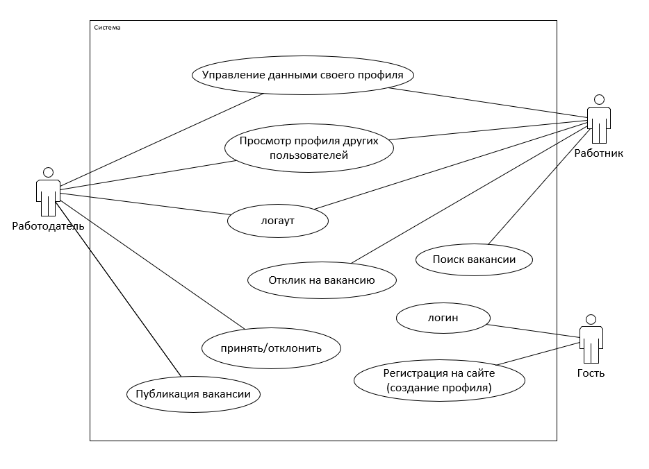

#_Freelancer_

# Бизнес-требования

Предназначен найти разовую работу и найма работников.

## Действующие лица

С системой взаимодействуют следующие действующие лица:

- Гость: человек, который еще не зашел на сайт.
- Работник: человек имеющий возможность искать вакансию.
- Работодатель: человек имеющий возможность опубликовать разовую работу.

## Варианты использования

Варианты использования - высокоуровневые сценарии, описывающие задачи, которые выполняет система и действующие лица, которые в этих сценариях участвуют.

### Классификация по действующим лицам

**Гост**

- Регистрация на сайте
- Логин

**Работник:**

- Поиск вакансии
- Отклик на вакансию
- Логаут
- Открыть личный профиль другого пользователя
- Управление данными своего профиля

**Работодатель:**

- Публикация разовой работы
- Взаимодействие с откликнувшимся (отказать, принять)
- Логаут
- Открыть личный профиль другого человека
- Управление данными своего профиля

Диаграмма вариантов использования приведены на следующем рисунке:

