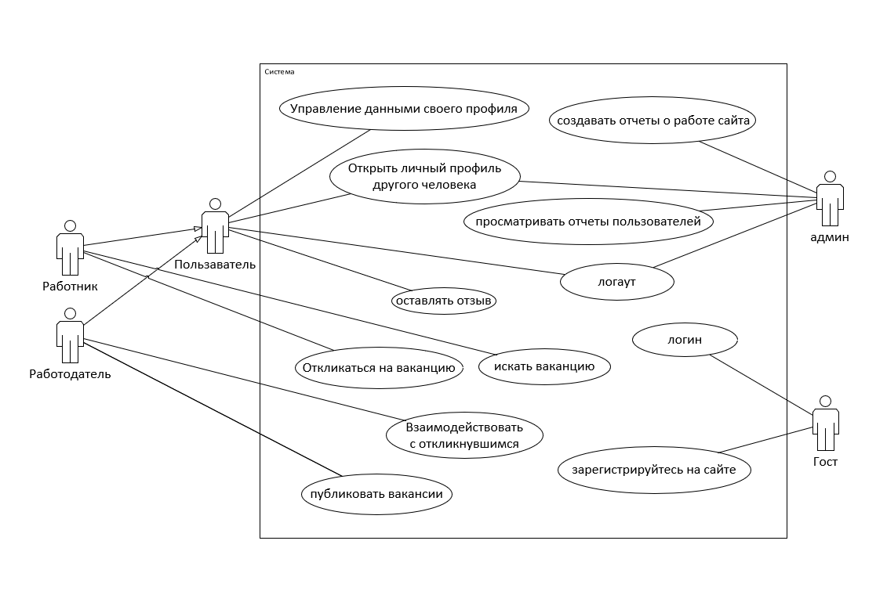

#_Freelancer_

# Бизнес-требования
Предназначен найти разовую работу и найма работников.

## Действующие лица
С системой взаимодействуют следующие действующие лица:

- Гость: человек, который еще не зашел на сайт.
- Работник: человек имеющий возможность искать ваканцию.
- Работодатель: человек имеющий возможность опубликовать разовую работу.
- Пользаватель: и работник и работодатель.
- Админ: человек, который пишет отчеты о работе сайта и следит за отчетами пользователей (о работе сайта или о других людях).

## Варианты использования
Варианты использования - высокоуровневые сценарии, описывающие задачи, которые выполняет система и действующие лица, которые в этих сценариях участвуют.

### Классификация по действующим лицам

**Гост**
- Зарегистрируйтесь на сайте
- Логин

**Пользаватель**
- Логаут
- Открыть личный профиль другого человека
- Oставлять отзыв
- Управление данными своего профиля

**Работник:**
  - искать ваканцию
  - Oткликаться на ваканцию

**Работодатель:**
  - Опубликовать разовую работу
  - Взаимодействовать с откликнувшимся (отказать, принять)

**Админ:**
- писать отчеты о работе сайта
- следить за отчетами пользователей
- Открыть личный профиль работников
- Логаут

Диаграмма вариантов использования приведены на следующем рисунке:

